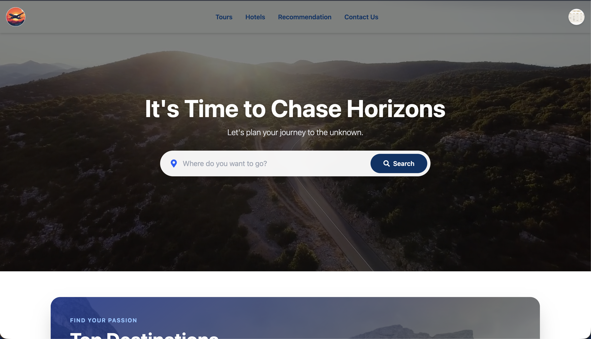
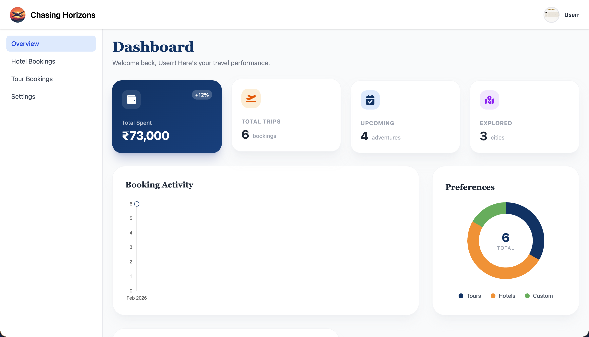

## Project Title and Description
### Chasing Horizons - Travel & Tourism Management System
Chasing Horizons is a full-stack travel platform that connects travelers, hotel managers, tour guides, employees, owners, and admins in one role-based system. Users can discover tours and hotels, make bookings, request custom tours, and use an AI assistant for recommendations.

## Tech Stack
- Frontend: React 19, Vite, Tailwind CSS, Redux Toolkit, React Router
- Backend: Node.js, Express.js
- Database: MongoDB (Mongoose)
- Auth and Security: JWT, HTTP-only cookies, Helmet, CORS, express-rate-limit
- Caching and Performance: Redis / Upstash Redis
- File and Media: Multer, Cloudinary
- AI: Google Gemini API
- Testing: Jest, Supertest
- Deployment and Containers: Docker, Docker Compose

## Core Features
- Role-based authentication and routing for traveler, admin, hotel manager, tour guide, employee, and owner flows
- Tour and hotel discovery with search, filtering, and booking management
- Custom tour request workflow with assignment and management dashboards
- Admin analytics and operational dashboards for platform monitoring
- AI chatbot and recommendation endpoints powered by Gemini
- Production-ready API concerns including logging, rate limiting, and API docs

## Quick Setup
1. Clone the repository and move into the project root.
2. Create a `.env` file in the project root (used by Docker) and add backend environment variables.
3. Start with Docker Compose:
   ```bash
   docker compose up --build
   ```
4. Access the apps:
- Frontend: `http://localhost`
- Backend: `http://localhost:5500`

### Run Without Docker
1. Start MongoDB locally or use MongoDB Atlas.
2. In `backend/`, create a `.env` file with required variables:
   ```env
   PORT=5500
   MONGO_URI=your_mongodb_connection_string
   JWT_SECRET=your_jwt_secret
   FRONTEND_URL=http://localhost:5173
   GEMINI_API_KEY=your_gemini_api_key
   CLOUDINARY_CLOUD_NAME=your_cloud_name
   CLOUDINARY_API_KEY=your_cloudinary_api_key
   CLOUDINARY_API_SECRET=your_cloudinary_api_secret
   EMAIL_USER=your_email
   EMAIL_PASS=your_email_password_or_app_password
   REDIS_URL=your_redis_url_optional
   ```
3. Install and run backend:
   ```bash
   cd backend
   npm install
   npm run dev
   ```
4. Open a new terminal, install and run frontend:
   ```bash
   cd frontend
   npm install
   npm run dev
   ```
5. Access the apps:
- Frontend: `http://localhost:5173`
- Backend: `http://localhost:5500`

## screenshots




